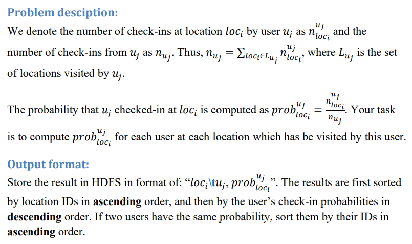

# MRJob Practice
This project is to perform data analytics over a dataset of online social networks using MRJob. 

The dataset contains users’ check-in history, in which each record is in format of 
“userID, locID, check_in_time”, where userID (string type) is the ID of a user, locID 
(string type) is the ID of a location, and check_in_time is the timestamp of the user’s 
check-in at this location. A sample file is like below: 
​				u1,l1,t1 
​				u1,l1,t2 
​				u1,l2,t3 
​				u2,l1,t4 
​				u2,l3,t5 
​				u3,l2,t6 
​				u3,l2,t7 
​				u3,l3,t8 

For example, given the above data set, the output is (there is no need to remove the 
quotation marks which are generated by MRJob): 

​				"l1" "u1,0.6667" 
​				"l1" "u2,0.5" 
​				"l2" "u3,0.6667" 
​				"l2" "u1,0.3333" 
​				"l3" "u2,0.5" 
​				"l3" "u3,0.3333" 