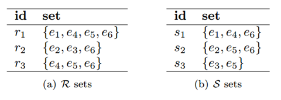

# Similarity Join Using Pyspark
### Problem Definition:

Given two collections of records R and S, a similarity function **sim**(.,.), and a threshold τ, the set similarity join between R and S, is to find all record pairs r (from R) and s (from S), such that **sim**(r, s) >= τ. We compute **sim**(.,.) using the Jaccard similarity in this project.

Given the above example, and set τ=0.5, the results are (r1, s1) (similarity 0.75), (r2, s2)(similarity 0.5), (r3, s1) (similarity 0.5), (r3,s2) (similarity 0.5). 

### Input file:

Each set is stored in one textfile, and each line is in format of: “RecordId list<ElementId>”. Twoexample input files are as below (elements are separated by space): 

| File1                                    | File2                             |
| ---------------------------------------- | --------------------------------- |
| 0 e1 e4  e5 e6  1 e2 e3  e6  2 e4 e5  e6 | 0 e1 e4  e6  1 e2 e5  e6  2 e3 e5 |

**Note that it is possible that one element appears multiple times in a record. You need to convert the record to a set first to compute the Jaccard similarity.*

### Output:

The output file contains the similar pairs together with their similarity scores. Each line is in format of “(RecordId1,RecordId2)**\t**Similarity” (RecordId1 is from the first file and RecordId2 is from the second file). **Round the similarities to six decimal places. **The pairs are sorted in ascending order by the first record and then the second. Given the example input data, the output file is like:

​			 	 (0,0)**\t**0.75
 				 (1,1)**\t**0.5
 				 (2,0)**\t**0.5
 				 (2,1)**\t**0.5

